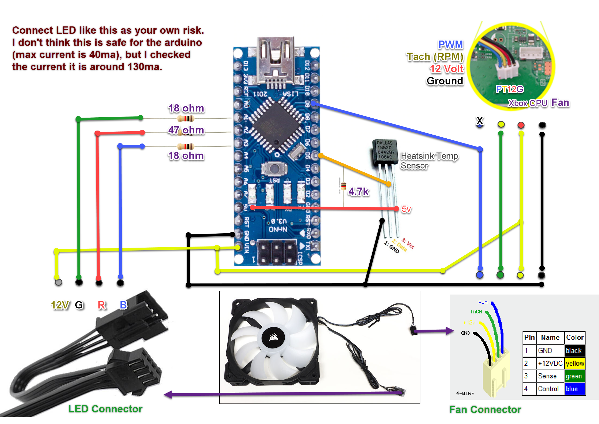

# Xbox Fan Controller

---
### Parts
* Arduino Nano
* 12V LED PWM Fan (4pins fan, 3pins does not have PWM)
	* LED is option
* DS18B20 Temperature Sensor
* 2x 18ohm resistors (15-25 ohm)
* 1x 47ohm resistor (30-50 ohm)
* 4.7k ohm resistor

### Mount Temperature Probe
> The best place to mount the probe is on the copper part in the center of the heat sink.
>
> If you have thermal epoxy, that would be the best. If not you can use thermal compound in the center of the sensor to transfer heat, then use super glue or silicone on the side of the sensor to fixed it in place.
>
> Don't use hot glue as it will melt.

### PWM Signal
> PC Fan uses 25KHz sign to control the fan speed, but arduino only output 10KHz signal. Some smart people figured it out a way to use the timer to boost the sign to 25KHz on pin 9 and 10. I'm not sure how it work, but it works.
[https://arduino.stackexchange.com/questions/25609/set-pwm-frequency-to-25-khz](Link to the solution)
